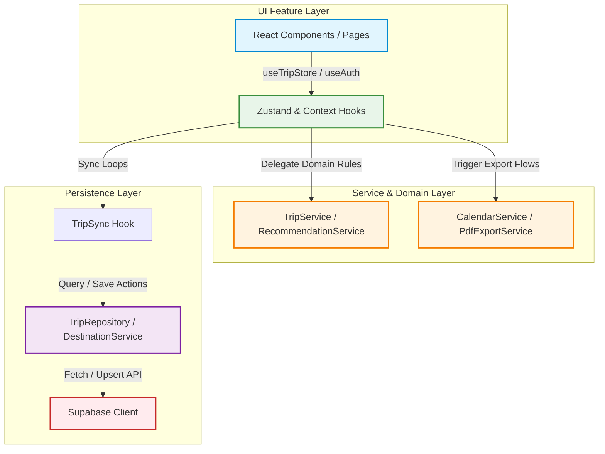

# TabiMap Architecture Documentation

This document outlines the architectural design and directories layering guidelines for TabiMap.

---

## Directory Responsibilities

### 1. Presentation Layer (`src/features/`)
- Contains all visual components, styling, pages, and interactive presentation layouts.
- **Rule**: Presentation files must not contain core business algorithms (e.g. scoring math, budget adjustments, validation rules).

### 2. State & Coordination Layer (`src/shared/hooks/`)
- Houses global stores and contexts (e.g., `useTripStore`, `useAuth`, `useTripSync`).
- **Rule**: Stores coordinate state and triggers but must delegate all rules/calculations down to the **Service Layer** to avoid bloat.

### 3. Service Layer (`src/shared/services/`)
- Contains pure, framework-agnostic business logic.
- Includes the recommendation engine scorers, token search matchers, and itinerary planners.
- **Rule**: Files in this layer must remain **100% React-free** (no hooks, no JSX, no state framework imports) and testable in isolation.

### 4. Repository Layer (`src/shared/services/trips/TripRepository.ts`)
- Encapsulates database storage drivers (Supabase, LocalStorage) to keep business services decoupled from specific database schemas or API clients.

### 5. Domain Models (`src/shared/types/`)
- Centralized type contracts (e.g., `trip.ts`, `destination.ts`).
- **Rule**: Standardize enums using `as const` object mappings to remain compatible with `erasableSyntaxOnly` TS transpilation environments.

---

## Data Pipeline & License-Safe Image Sourcing (`scripts/pipeline.cjs`)

TabiMap maintains a 5-stage automated data ingestion and validation pipeline:

1. **Schema & Content Validation**: Asserts required fields, rating bounds (1-10), budget sanity (`budgetMin <= budgetMax`), and duplicate ID checks across 129 destinations.
2. **Geocoding & Coordinates**: Queries OpenStreetMap Nominatim for missing coordinates with rate-limit delays.
3. **Data Normalization**: Normalizes recommended budgets, populates missing crowd/season defaults, and enforces tag arrays.
4. **License-Safe Image Sourcing (Openverse / Wikimedia)**: Programmatically queries the Openverse API (`https://api.openverse.org/v1/images/?q={name}+Japan&license_type=commercial`) to filter commercial-safe images (`CC0`, `CC-BY`, `CC-BY-SA`, Public Domain) and embeds `imageMetadata` (source, license type, creator attribution, landing URL) into destination schemas.
5. **Output & Public Sync**: Sorts and formats `src/shared/data/destinations-index.json` and syncs individual detail JSON files in `public/data/destinations/`.

---

## Custom Badges Architecture & Dataset Metadata

Destinations are tagged with special metadata badges rendered in `DestinationCard.tsx` and `DestinationDetails.tsx`:
- 🏰 **`12 Original Keeps`** (`bg-amber-500`): Highlights the 12 original surviving wooden keeps (Matsumoto, Inuyama, Hikone, Maruoka).
- 🗼 **`World's Tallest Tower`** (`bg-sky-600`): Highlights Tokyo Skytree (634m).
- 🏯 **`Top 100 Castle`** (`bg-rose-600`): Highlights certified 100 Fine Castles of Japan.
- 🏙️ **`Free Observatory`** (`bg-emerald-600`): Highlights free high-rise observatories (Tokyo Metropolitan Government Building, Befco Bakauke).

